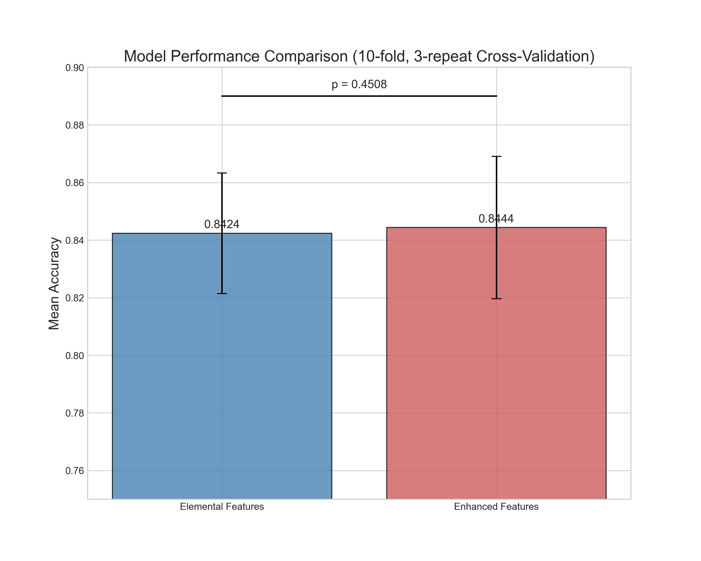
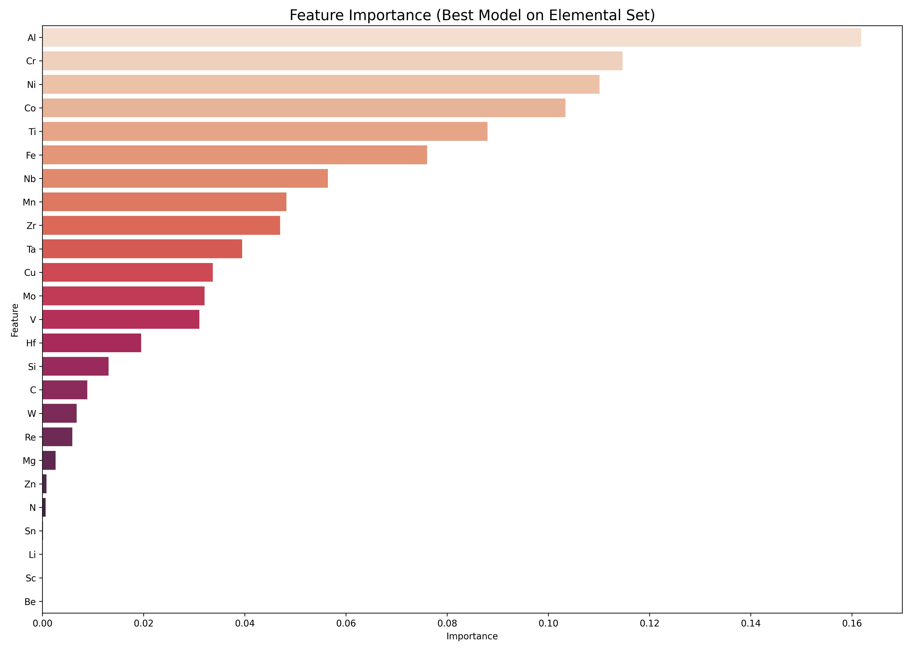
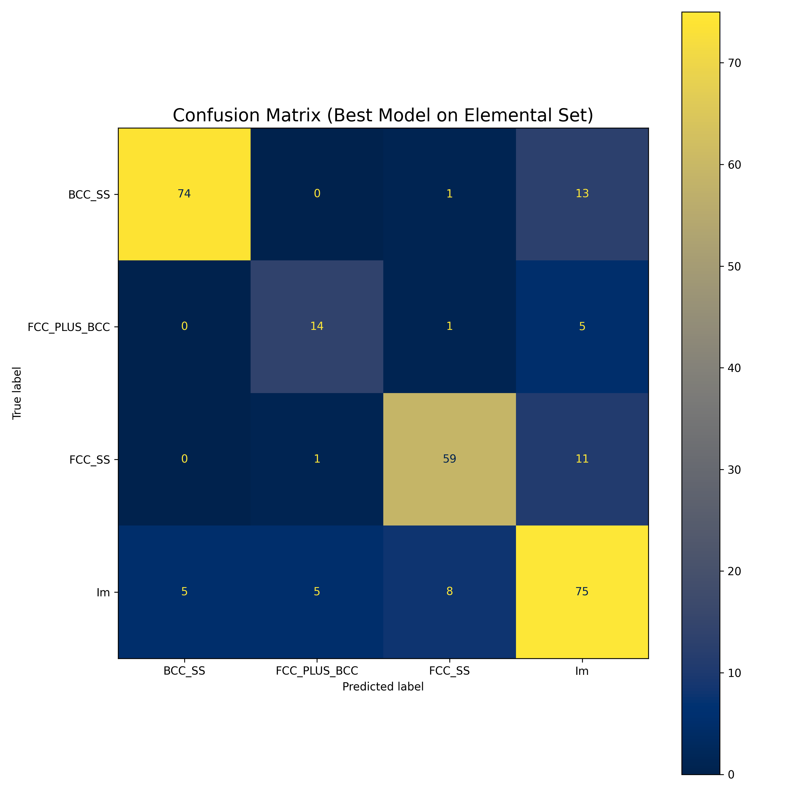
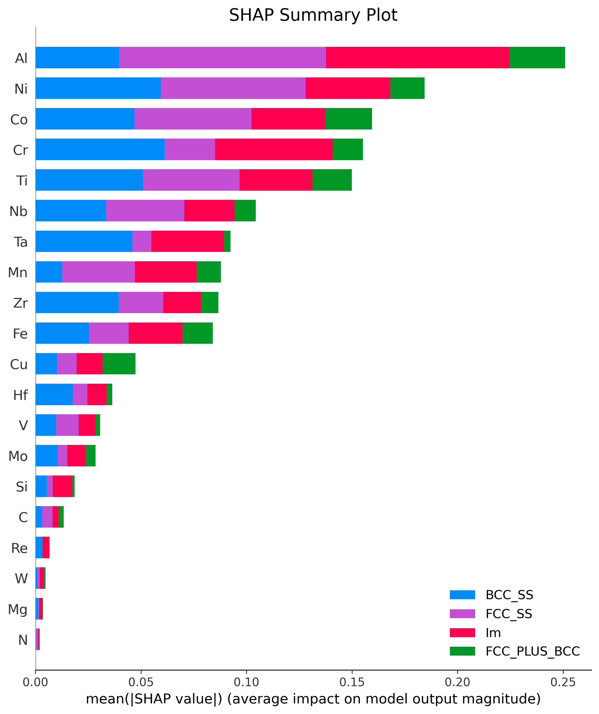
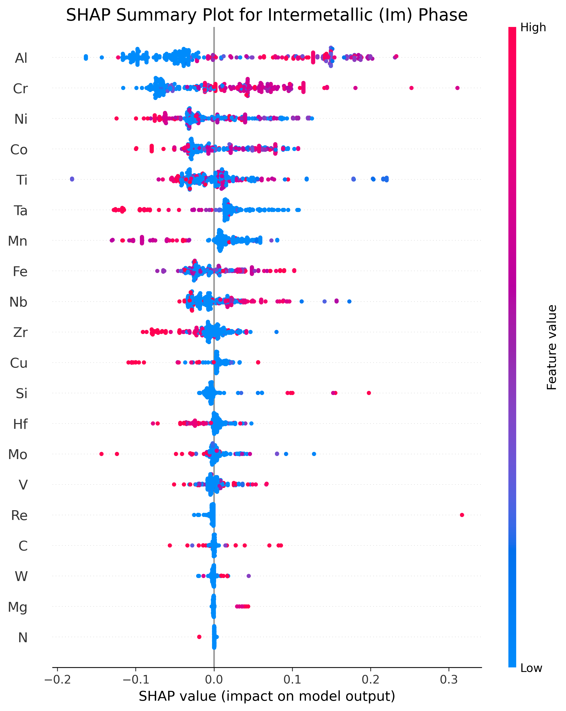

# High-Entropy Alloy Phase Prediction using Machine Learning

This repository contains the complete code and results for a machine learning project aimed at predicting the phase formation in High-Entropy Alloys (HEAs). The project utilizes a Random Forest Classifier to analyze the relationship between alloy composition and resulting phases, providing insights into feature importance and model interpretability through SHAP analysis.

## Key Results

The analysis pipeline produces a series of visualizations that summarize the project's key findings.

| Figure 1: Model Performance Comparison | Figure 2: Feature Importance |
| :---: | :---: |
|  |  |
| *Comparison of model accuracy between a simple elemental feature set and an enhanced set with physical properties. The difference was not statistically significant (p = 0.2144), justifying the use of the simpler model.* | *Gini importance ranking for the elemental features. Al, Cr, and Ni are identified as the most influential elements in phase prediction.* |

| Figure 3: Confusion Matrix | Figure 4: Global SHAP Summary |
| :---: | :---: |
|  |  |
| *Performance of the final model on an independent test set, showing high accuracy in predicting the BCC_SS and Im phases.* | *Mean absolute SHAP values, providing a more robust measure of global feature importance. The ranking is consistent with the Gini importance.* |

| Figure 5: SHAP Analysis for Intermetallic (Im) Phase |
| :---: |
|  |
| *Detailed SHAP analysis for the 'Im' phase. High concentrations of Ta and Zr (red dots) strongly push the prediction towards 'Im', while high concentrations of Al and Cr (blue dots) push the prediction away from it.* |

---

## Repository Structure

The project is organized into the following structure:

```
HEA_Project/
│
├── HEA_DataSet.xlsx          # The raw dataset used for training and evaluation. https://data.mendeley.com/datasets/7fhwrgfh2s/3
│
├── 1_train_and_evaluate.py   # Script 1: Performs all data processing, model training, and analysis.
├── 2_generate_figures.py     # Script 2: Generates all figures from the results of Script 1.
│
├── requirements.txt          # A list of all Python dependencies.
├── README.md                 # This file.
│
├── output/                   # (Auto-generated) Stores all computational artifacts (models, SHAP values, etc.).
└── figures/                  # (Auto-generated) Stores all final figures.
```

---

## Dependencies

This project requires Python 3. To install all necessary libraries, it is recommended to use the provided `requirements.txt` file.

Key libraries include:
- `pandas` & `openpyxl`
- `numpy`
- `scikit-learn`
- `scipy`
- `shap`
- `matplotlib`
- `seaborn`
- `joblib`

---

## How to Reproduce the Results

Follow these steps to run the analysis and generate all figures from scratch:

1.  **Clone the Repository:**
    ```bash
    git clone https://github.com/YourUsername/YourRepositoryName.git
    cd YourRepositoryName
    ```

2.  **Install Dependencies:**
    It is highly recommended to use a virtual environment.
    ```bash
    python -m venv venv
    source venv/bin/activate  # On Windows, use `venv\Scripts\activate`
    pip install -r requirements.txt
    ```

3.  **Run the Computation and Training Script:**
    This script will perform all calculations and create the `output/` directory with all necessary artifacts.
    ```bash
    python 1_train_and_evaluate.py
    ```

4.  **Run the Figure Generation Script:**
    This script will load the artifacts from the `output/` directory and generate all five figures in the `figures/` directory.
    ```bash
    python 2_generate_figures.py
    ```

5.  **Check the Results:**
    All five PNG images, identical to the ones shown above, will now be available in the `figures/` folder.

---

## Methodology Overview

-   **Model:** A Random Forest Classifier was used for its robustness and interpretability.
-   **Feature Sets:** Two feature sets were compared:
    1.  **Elemental Features:** 25 columns representing the elemental composition.
    2.  **Enhanced Features:** 32 columns including elemental composition and 7 physical properties.
-   **Validation Strategy:** A `RepeatedStratifiedKFold` cross-validation (10 splits, 3 repeats) was employed for a robust comparison between the feature sets.
-   **Statistical Test:** A paired t-test was used to determine the statistical significance of the performance difference between the two models.
-   **Model Interpretation:** Gini Importance and SHAP (SHapley Additive exPlanations) values were used to interpret the final model's predictions.
